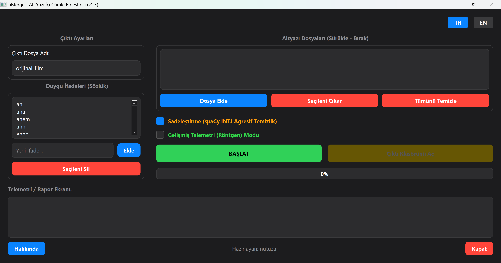

# nMerge  
### Smart Subtitle (SRT) Preprocessor and Grammar Engine

> *(Türkçe açıklama için aşağıya kaydırın / Scroll down for the Turkish version)*


---

# 🇬🇧 English

## nMerge
### Smart Subtitle (SRT) Preprocessor and Grammar Engine for LLM Translation Optimization

---

## Project Purpose and Philosophy

nMerge is an NLP-supported preprocessing automation developed to prepare subtitle (`.srt`) files not for traditional viewing experiences, but for Large Language Model (LLM) based AI translation engines.

Modern Speech-to-Text (STT) software references speakers' breathing patterns and scene silence durations (timestamps) rather than grammar rules when transcribing speech. This causes single sentences to be split at meaningless points and distributed across multiple subtitle lines.

When these half-sentences — with their contexts broken and subjects disconnected from verbs — are sent line by line to LLM translation engines, translation quality collapses. The engine loses contextual continuity and begins producing hallucinations.

nMerge adopts the philosophy:

> **"Respect grammatical integrity, not physical timing."**

Using the `spaCy` NLP library, nMerge extracts the grammatical anatomy of sentences, overrides fake punctuation fabricated by STT systems, and tears down time barriers to stitch fragmented subtitle lines back together — ensuring that the translation engine sees the text as one complete semantic context.

---

## NLP Engine

At its core, nMerge uses spaCy’s pre-trained NLP model:

`en_core_web_sm` *(English Core Web Small)*

This lightweight yet highly efficient Convolutional Neural Network (CNN), trained on the OntoNotes dataset, performs:

- Part-of-Speech tagging
- Syntactic dependency analysis
- Conjunction/adposition detection
- Incomplete sentence structure detection

Unlike giant LLM pipelines, nMerge intentionally avoids API latency and heavyweight inference costs.

As a result:

- Thousands of subtitle lines can be processed in milliseconds
- Fully offline execution
- Extremely low CPU usage
- Deterministic preprocessing behavior

---

# Core Capabilities and Algorithmic Solutions

---

## 1. Time-Independent Absolute Grammar Merging

Unlike traditional synchronization tools, nMerge completely ignores the time gap between subtitle lines.

If the end of one subtitle and the beginning of the next form a grammatical continuation, the lines are merged regardless of elapsed time.

---

## 2. Unconditional Punctuation Dictatorship

Binding punctuation marks intentionally left by STT systems or translators are treated as absolute merge commands.

Supported merge-trigger punctuation:

- `,`
- `;`
- `:`
- `...`
- `--`
- `---`

If one of these appears at the end of a line, merging occurs immediately regardless of capitalization.

---

## 3. Deep POS Analysis and Fake Period Override

STT systems frequently place erroneous periods (`.`) or exclamation marks (`!`) in the middle of unfinished sentences during speaker pauses.

nMerge temporarily ignores trailing punctuation and analyzes the last meaningful token.

If the final word belongs to one of these grammatical classes:

- `ADP` (Adposition)
- `CCONJ` (Coordinating Conjunction)
- `SCONJ` (Subordinating Conjunction)
- `AUX` (Auxiliary Verb)
- `PART` (Particle)

the sentence is classified as incomplete and forced to merge with the next subtitle line.

---

## 4. Advanced Regex Surgical Cleaning and Protections

### Dialogue Protection

If the next subtitle line begins with a single dash (`-`), nMerge interprets this as a speaker transition and refuses merging.

---

### Fake Period Annihilation

Incorrect isolated periods trapped between merged fragments are surgically removed.

---

### Residue Cleaning

Residual ellipses and double dashes are cleaned to smooth sentence flow.

---

## 5. Smart Interjection and Filler Word Filter

Meaningless standalone emotional fillers such as:

- `"Mmm."`
- `"Ah!"`
- `"Uh-huh"`

are completely removed when isolated on their own subtitle line.

However, embedded usages such as:

> `"Oh, I see."`

are preserved safely.

---

## 6. Stateful Orthography and Case Corrector

STT systems frequently capitalize words incorrectly in the middle of sentences.

Using grammatical state awareness:

- If the previous subtitle did not genuinely terminate,
- The first word of the next line is forced to lowercase

Exceptions:

- Proper nouns
- The pronoun `"I"`

---

# 🛠️ Installation & Usage

---

## Requirements

- Python 3.8+
- PyQt5
- pysubs2
- spaCy
- en_core_web_sm *(spaCy English Model)*

---

## Setup

### Install dependencies

```bash
pip install PyQt5 pysubs2 spacy
```

### Download spaCy English model

```bash
python -m spacy download en_core_web_sm
```

---

## Running the GUI

```bash
python nMergeGUI.py
```

---

## Portable Version

> Standalone executable (Portable Windows version) can be downloaded from the **Releases** section of this repository.

---

# 🇹🇷 Türkçe

## nMerge
### LLM Çeviri Optimizasyonu İçin Akıllı Altyazı (SRT) Ön İşlemci ve Gramer Motoru

---

## Projenin Amacı ve Felsefesi

nMerge, altyazı (`.srt`) dosyalarını geleneksel izleme deneyimi için değil, Büyük Dil Modeli (LLM) tabanlı yapay zeka çeviri motorlarına hazırlamak amacıyla geliştirilmiş NLP destekli bir ön işlem otomasyonudur.

Modern Speech-to-Text (STT) yazılımları, konuşma metnini yazıya dökerken gramer kurallarını değil; konuşmacının nefes alışlarını ve sahnelerdeki sessizlik sürelerini referans alır.

Bu nedenle tek bir cümle anlamsız noktalardan bölünür ve farklı altyazı satırlarına dağılır.

Bağlamı parçalanmış, öznesi ve yüklemi ayrılmış bu yarım cümleler LLM tabanlı çeviri motorlarına satır satır gönderildiğinde:

- Çeviri kalitesi çöker
- Bağlam kaybolur
- Halüsinasyon üretimi başlar

nMerge şu felsefeyi benimser:

> **"Fiziksel zamanlamaya değil, gramatikal bütünlüğe saygı duy."**

`spaCy` NLP kütüphanesi kullanılarak:

- Cümlelerin dilbilgisel anatomisi çıkarılır
- STT’nin ürettiği sahte noktalama işaretleri ezilir
- Zaman bariyerleri yıkılır
- Parçalanmış altyazılar tekrar tek bir semantik bağlama dönüştürülür

---

## NLP Motoru

nMerge’in merkezinde spaCy’nin şu modeli bulunur:

`en_core_web_sm` *(English Core Web Small)*

Bu model:

- OntoNotes veri setiyle eğitilmiş
- Hızlı ve hafif bir CNN mimarisine sahip
- POS tagging ve sentaktik analiz konusunda oldukça başarılıdır

Devasa LLM altyapılarının hantallığından bilinçli şekilde kaçınan nMerge:

- Binlerce satırı milisaniyeler içinde işler
- Tamamen offline çalışır
- İşlemciyi zorlamaz
- Deterministik sonuç üretir

---

# Temel Yetenekler ve Algoritmik Çözümler

---

## 1. Zaman-Bağımsız Mutlak Gramer Birleştirmesi

nMerge, altyazılar arasındaki zaman farkını tamamen görmezden gelir.

Eğer iki satır dilbilgisel olarak birbirinin devamıysa, aradan ne kadar süre geçmiş olursa olsun tek blok halinde birleştirilir.

---

## 2. Şartsız Noktalama Diktatörlüğü

Aşağıdaki işaretler mutlak birleştirme komutu kabul edilir:

- `,`
- `;`
- `:`
- `...`
- `--`
- `---`

Alt satırın büyük/küçük harfle başlaması önemsenmez.

---

## 3. Derin POS Analizi ve Sahte Nokta İhlali

STT yazılımları konuşma duraksamalarında cümlenin ortasına yanlışlıkla:

- `.`
- `!`

yerleştirebilir.

nMerge:

- Son noktalama işaretini geçici olarak yok sayar
- Son anlamlı kelimeyi analiz eder

Eğer kelime şu türlerden biriyse:

- `ADP`
- `CCONJ`
- `SCONJ`
- `AUX`
- `PART`

cümlenin tamamlanmadığı kabul edilir ve zorunlu birleştirme uygulanır.

---

## 4. Regex ile Cerrahi Temizlik ve Korumalar

### Diyalog Koruması

Alt satır tek bir tire (`-`) ile başlıyorsa farklı konuşmacı kabul edilir ve birleştirme reddedilir.

---

### Sahte Nokta İmhası

Birleştirme sırasında ortada kalan hatalı tekil noktalar temizlenir.

---

### Kalıntı Temizliği

Artık üç noktalar ve çift tireler temizlenerek metin akıcı hale getirilir.

---

## 5. Akıllı Nida ve Filler Word Filtresi

Şu tür anlamsız tekil ifadeler:

- `"Mmm."`
- `"Ah!"`
- `"Uh-huh"`

tamamen silinir.

Ancak:

> `"Oh, I see."`

gibi anlam taşıyan yapılar korunur.

---

## 6. Hafızalı Büyük/Küçük Harf Düzeltici

STT sistemlerinin cümle ortasında yanlışlıkla büyük harfle başlattığı kelimeler düzeltilir.

Eğer önceki satır gerçekten bitmemişse:

- Yeni satırın ilk harfi küçültülür

İstisnalar:

- Özel isimler
- `"I"` zamiri

---

# 🛠️ Kurulum ve Kullanım

---

## Gereksinimler

- Python 3.8+
- PyQt5
- pysubs2
- spaCy
- en_core_web_sm

---

## Kurulum

### Gerekli kütüphaneleri yükleyin

```bash
pip install PyQt5 pysubs2 spacy
```

### spaCy İngilizce modelini indirin

```bash
python -m spacy download en_core_web_sm
```

---

## Arayüzü Çalıştırma

```bash
python nMergeGUI.py
```

---

## Portable Sürüm

> Portable Windows sürümü, repository’nin sağ tarafındaki **Releases** bölümünden indirilebilir.

---

# Author

Developed by **nutuzar**  
**nMerge Automation v1.0**
